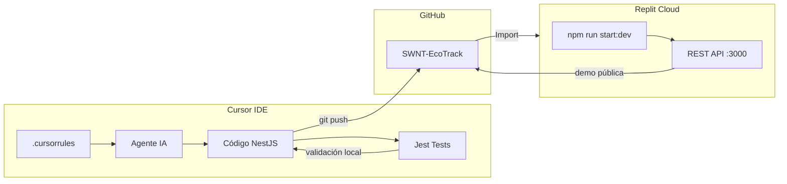
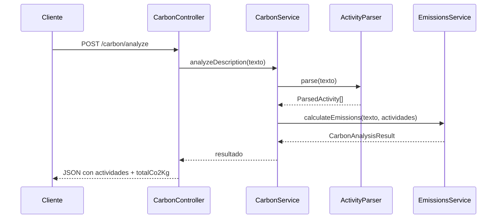

# EcoTrack

Aplicación web backend que permite registrar la huella de carbono diaria utilizando **lenguaje natural**. El usuario describe sus actividades en texto libre y el sistema detecta actividades de transporte y alimentación, estima las emisiones de CO₂ y devuelve un total consolidado.

> **MVP:** parsing basado en reglas (sin IA externa), preparado para reemplazar el parser por un servicio de IA en el futuro.

---

## Enlaces del ecosistema

| Recurso | Enlace |
|---------|--------|
| **Repositorio (GitHub)** | [https://github.com/JulianLopez11/SWNT-EcoTrack](https://github.com/JulianLopez11/SWNT-EcoTrack) |
| **Repl (Replit)** | Importar desde GitHub → [replit.com/import/github](https://replit.com/import/github) usando la URL del repositorio. Actualiza este enlace con tu Repl público una vez desplegado. |
| **`.cursorrules`** | [`.cursorrules`](./.cursorrules) — reglas y personalidad del agente de IA en Cursor |
| **Vibe Report** | [`VIBE_REPORT.md`](./VIBE_REPORT.md) — reflexión sobre configuración y flujo de trabajo (≤ 500 palabras) |
| **Captura de pantalla** | [`docs/screenshots/cursor-replit-ecosystem.png`](./docs/screenshots/pruebaPostMan.png)|

---

## Integración Cursor + Replit



| Entorno | Función |
|---------|---------|
| **Cursor** | Desarrollo asistido por IA, arquitectura, pruebas unitarias y reglas persistentes en `.cursorrules` |
| **GitHub** | Fuente de verdad del código; puente entre Cursor y Replit |
| **Replit** | Ejecución en la nube, demo del prototipo y verificación de despliegue |

---

## Arquitectura

El backend sigue una arquitectura **modular** de NestJS con tres módulos independientes y un punto de extensión para IA futura.

```
src/
├── carbon/                 # Capa de aplicación (REST)
│   ├── carbon.controller.ts
│   ├── carbon.service.ts
│   └── dto/
├── parsing/                # Interpretación de lenguaje natural
│   ├── parsing.service.ts  → RuleBasedParsingService
│   ├── interfaces/         → ActivityParser (contrato para IA)
│   └── rules/
│       ├── transport.rule.ts
│       └── food.rule.ts
└── emissions/              # Cálculo de huella de carbono
    ├── emissions.service.ts
    └── constants/
        └── emission-factors.ts
```

### Flujo de datos



### Responsabilidades por módulo

| Módulo | Responsabilidad |
|--------|-----------------|
| **`carbon`** | Expone la API REST, valida el DTO de entrada y orquesta parsing + emisiones |
| **`parsing`** | Detecta actividades en texto libre (transporte y alimentación) mediante reglas y keywords en español |
| **`emissions`** | Aplica factores de emisión (kg CO₂/km o kg CO₂/comida) y calcula el total |

### Extensibilidad hacia IA

El servicio de parsing implementa la interfaz `ActivityParser`. Para integrar IA en el futuro:

1. Crear `AiParsingService implements ActivityParser`
2. Registrar el provider en `ParsingModule` en lugar de `RuleBasedParsingService`
3. No modificar `CarbonController`, `CarbonService` ni `EmissionsService`

---

## Endpoints REST

Base URL local: `http://localhost:3000`  
Base URL Replit: `https://550b7264-4362-4cda-a9bf-382d883fbb57-00-38qv1ortabufg.spock.replit.dev/`

| Método | Ruta | Descripción | Body | Respuesta |
|--------|------|-------------|------|-----------|
| `GET` | `/` | Health check del servidor | — | `"Hello World!"` |
| `POST` | `/carbon/analyze` | Analiza una descripción en lenguaje natural y calcula emisiones | `{ "description": "string" }` | Actividades detectadas, emisiones por actividad y total CO₂ |

### `POST /carbon/analyze`

**Request:**

```json
{
  "description": "Hoy comí carne y viajé 20km en bus"
}
```

**Response (200 OK):**

```json
{
  "description": "Hoy comí carne y viajé 20km en bus",
  "activities": [
    {
      "type": "food",
      "category": "beef",
      "description": "Hoy comí carne",
      "quantity": 1,
      "unit": "meal",
      "co2Kg": 6.61
    },
    {
      "type": "transport",
      "category": "bus",
      "description": "20km",
      "quantity": 20,
      "unit": "km",
      "co2Kg": 1.78
    }
  ],
  "totalCo2Kg": 8.39
}
```

**Errores comunes:**

| Código | Causa |
|--------|-------|
| `400` | Body inválido (description vacía, tipo incorrecto o campos no permitidos) |
| `422` | Validación fallida por `class-validator` |

### Ejemplo con cURL

```bash
curl -X POST http://localhost:3000/carbon/analyze \
  -H "Content-Type: application/json" \
  -d "{\"description\": \"Hoy comí carne y viajé 20km en bus\"}"
```

---

## Actividades detectadas (MVP)

| Tipo | Categorías | Unidad |
|------|------------|--------|
| **Transporte** | bus, carro, metro, tren, taxi, moto, avión, bicicleta, caminar | km |
| **Alimentación** | carne, pollo, pescado, vegetariano, vegano | comida (meal) |

---

## Factores de emisión (referencia)

| Categoría | Factor |
|-----------|--------|
| Bus | 0.089 kg CO₂/km |
| Carro / Taxi | 0.21 kg CO₂/km |
| Carne | 6.61 kg CO₂/comida |
| Pollo | 1.57 kg CO₂/comida |
| Caminar / Bicicleta | 0 kg CO₂/km |

---

## Instalación y ejecución

### Local (Cursor / terminal)

```bash
npm install
npm run start:dev    # desarrollo
npm run build        # compilar
npm test             # pruebas unitarias (22 tests)
```

### Replit

1. Ir a [replit.com/import/github](https://replit.com/import/github)
2. Pegar: `https://github.com/JulianLopez11/SWNT-EcoTrack`
3. Replit detecta `.replit` y `replit.nix` automáticamente
4. Pulsar **Run** → el servidor arranca en el puerto configurado

---

## Stack tecnológico

| Tecnología | Uso |
|------------|-----|
| NestJS 11 | Framework backend |
| TypeScript | Lenguaje principal |
| class-validator | Validación de DTOs |
| Jest | Pruebas unitarias |
| Cursor + `.cursorrules` | Desarrollo asistido por IA |
| Replit | Ejecución y demo en la nube |

---

## Estructura de entregables (rúbrica)

| Criterio | Entregable | Estado |
|----------|------------|--------|
| Integridad del ecosistema | Cursor + Replit + `.cursorrules` | Configurado |
| Ejecución técnica | API funcional, tests, build sin errores | Verificado |
| Mentalidad Vibe Coding | `VIBE_REPORT.md` | Incluido |
| Captura de pantalla | `docs/screenshots/cursor-replit-ecosystem.png` | Pendiente de subir |

---

## Licencia

Proyecto académico — SWNT EcoTrack.
